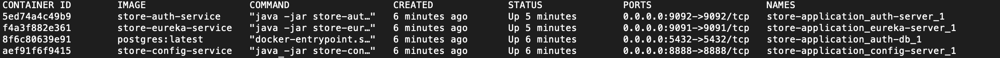

# store-application [](https://circleci.com/gh/fbourguignon/store-application/tree/master)

Template project with Spring Cloud starters.

- [x] Spring Boot 2.0.6
- [x] Spring Cloud (Finchley.SR2)
- [x] Spring Cloud Oauth 2
- [x] Spring Cloud Eureka Service Discovery
- [x] Spring Cloud Config Server
- [x] Docker
- [x] PostgresSQL

### Project structure 

- store-auth-service    (Oauth2 authorization server )
- store-config-service  (Distributed configuration server)
- store-eureka-service  (Service discovery server)
- store-product-service (Oauth2 resource server for product domain)

### Build Projects 
From project directory, run maven clean install.
```console
mvn clean install
```

### Run the Application

From project directory, start up the application by running.

```console
docker-compose up -d --build
```
Compose pulls and build the images from project, and starts the services and databases.



### Authentication
   
To request a token, the client must be registered on the authorization server and must send the client-id and the secret that we configured in the application.yml encoded in the Base 64.

   ```json
   POST /oauth/token?grant_type=password&username=jhon@gmail.com&password=123456 HTTP/1.1
   Host: localhost:9092
   Authorization: Basic Y2xpZW50OjEyMw==
   Content-Type: application/json
   Cache-Control: no-cache
   Postman-Token: adf4750e-4429-e983-9550-0c0523260e86
   ```
   
### Authorization

We have a two types of roles.

```json
ROLE_ADMIN
ROLE_USER   
```
